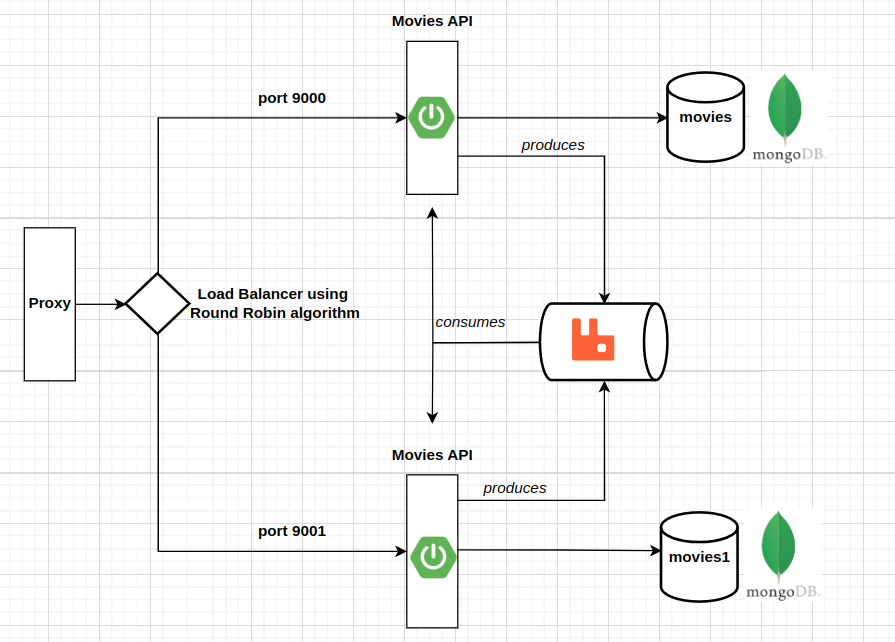

# Smart Proxy

We have 3 SpringBoot apps :
- EurekaServer
- MoviesApi
- MoviesGateway

First of all we start EurekaServer where all our applications are registered and we cand view their state (up/down).

We run/start 2 instances of MoviesApi, each one with its own port and database.

Finally we run MoviesGateway which acts as a proxy, gateway and load balancer.

From other services we need mongoDB and RabbitMq up and running.

## How it works

The proxy is exposed on port 8088. Here we make all requests at */movies* (Create Read Delete).

Lets say we make a request to get all movies, the proxy (MoviesGateway) redirects to uri */api/movies*  to one of instances of MoviesApi.

The algoritm of balancing is Round Robin, one request to an instance, following request to second instance.

And we get in response the list of movies.

When we make a POST request, after the movie is saved and is fetched by a Mongo Audit Listener
the event is sent to a queue of RabbitMq. The other instance is receiving the event from the queue
and if it doesn't have that object in MongoDB, saves it.

In RabbitMq we have 2 queues, one for senders and receivers. In our case MoviesApi is acting as a sender and receiver at the same time.

mvn spring-boot:run -Dspring-boot.run.profiles=dev1
mvn spring-boot:run
